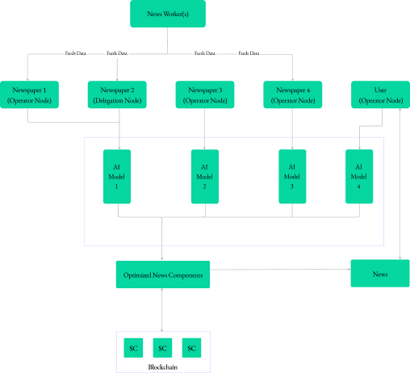

# 

**Bulletin** is a state-of-the-art AI platform designed to revolutionize news and media engagement. With a strong focus on transforming content creation through impactful visualizations like graphs and graphics, **Bulletin** aims to redefine user experiences. This repository contains the codebase for the **Bulletin** platform.

## Introduction

Unlike traditional content creation methods, which often struggle to meet the demands of today's dynamic digital landscape, **Bulletin** offers a comprehensive solution. It seamlessly integrates AI capabilities with user-friendly tools, reshaping how users interact with news and media. **Bulletin** prioritizes accessibility, efficiency, and impact in content creation, setting a new standard for engaging with information.

## Features

- **Content Enhancement**: Media houses and newspapers leverage AI tools to enhance content, reaching wider audiences and earning rewards based on engagement and quality.
- **Personalized Experience**: Users experience personalized, interactive news and contribute feedback, enriching the ecosystem's growth. Engage with dynamic data stories and immersive visualizations.
- **AI Models**: Empower the platform's core functions, continuously learning and evolving to deliver superior experiences over time.
- **Node Management**: Operator Nodes manage data, train AI models, and oversee news creation, ensuring seamless operations and workflow coordination.
- **Contribution Rewards**: Delegation Nodes contribute tokens to operator nodes, earning rewards based on contributions and adherence to network rules.
- **Source Stream**: Derive news content from diverse sources like news wires, social media feeds, and press releases.
- **Optimization**: Refine the news creation process using AI models and techniques, enhancing relevance, sentiment analysis, and readability.
- **Output Delivery**: Deliver final news content, ranging from graphs and summaries to multimedia, ready for consumption by users.

## Architecture

Figure 2.1: Conceptual Diagram of DApps

## Contributing

Contributions are welcome! Please read our [contribution guidelines](CONTRIBUTING.md) to get started.

## License

This project is licensed under the MIT License - see the [LICENSE](LICENSE) file for details.

## Acknowledgements

We would like to thank all contributors and supporters of the **Bulletin** project.

## Contact

For inquiries, please contact us at [info@bulletin.technology](mailto:info@bulletin.technology).
